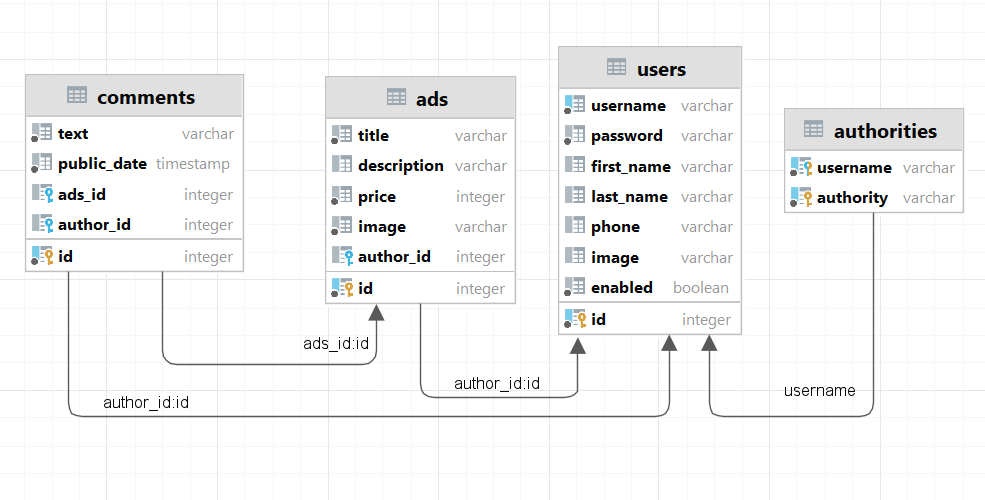

# FLEA MARKET BACK-END

Diploma project for students of Java developer course in Skypro.<br>
Flea market back-end application (according to [front-end part](https://github.com/BizinMitya/front-react-avito)).

## Tech Stack:
- Java 17, Maven
- Docker
- Spring (Boot, Web, Data, Security)
- PostgreSQL, H2 Database, Liquibase
- MapStruct, Lombok

## Contributors:
- [Epifanova Valeriya](https://github.com/LoliPis)
- [Nazarov Artem](https://github.com/safgbad)

## DB schema:

<p align="center">
  
</p>

## Launch

### Build DB, application and UI images:
```bash
docker compose build
```

### Build the images (DB, application and UI; if they have not built yet) and run the containers:
```bash
docker compose up --detach
```

### Rebuild the application image:
```bash
docker compose rm application --stop --force
```
```bash
docker compose up --build --no-deps --detach application
```

### Rebuild the DB image:
```bash
docker compose rm database --stop --volumes --force
```
```bash
docker compose down --volumes
```
```bash
docker compose up --build --detach database
```

### Rebuild the UI image:
```bash
docker compose rm ui --stop --force
```
```bash
docker compose up --build --no-deps --detach ui
```

### Rebuild all the images:
```bash
docker compose down --volumes
```
```bash
docker compose up --build --force-recreate --detach
```
